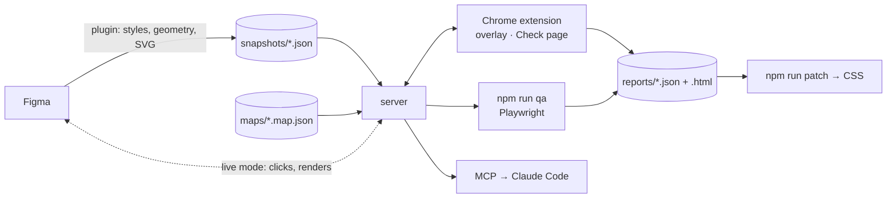

<div align="center">


# pixel-guard

**Pixel-perfect QA of your markup against Figma designs** — compares the live page
with the design *element by element* (computed CSS + geometry), not as a picture.
No Figma REST API and its limits: the data is pulled by its own plugin via the Plugin API.


</div>

---

Three parts, one server:

- **Figma plugin** — exports frames to `snapshots/*.json` (styles, geometry, SVG icons)
  and renders nodes on request. Plugin API only, no tokens, no 429.
- **Chrome extension** — side panel on your site: design overlay on top of the page
  (colors + text / PNG / outlines, curtain), viewport emulation per breakpoint,
  **Check page** with a per-property diff, binding with the mouse.
- **CLI + MCP** — headless comparison (`npm run qa`), auto-binding, PNG export, CSS
  patch proposals, pixel diff; MCP tools so Claude Code reads the design through the plugin.

The report is machine-readable — selector + property + `figma → actual` — so a fix can
be made without opening the design.

## Why not an existing overlay tool

Uiprobe, Over.fig, Overlayly, OnePixel, PerfectPixel, Visualign were tried. They put a
picture on top of the page and stop there:

- no binding "this Figma block ↔ this HTML element", so a height change higher up the
  page shifts everything below;
- no per-element comparison — you see that *something* is off, not that
  `font-size` is `46px` instead of `48px` on `.hero-title`;
- they break on unfinished pages and do not understand reusable blocks;
- the Figma REST API is rate-limited (429) and needs a token;
- nothing an agent can act on.

pixel-guard binds design nodes to selectors, compares computed styles with tolerances
and writes a report Claude Code can fix from.

## How it works



1. The plugin walks the frames and sends a node tree: fonts, colors with opacity,
   auto-layout padding/gap, radius, component names, SVG icons. One click exports the
   whole project and marks shared blocks (header, footer).
2. `maps/<page>.map.json` binds nodes to selectors — filled by `npm run automap`, with
   the mouse from the panel, or by hand. `@Component` keys cover every breakpoint and
   page with one line.
3. The extension (or `npm run qa`) reads the DOM: `getComputedStyle` + geometry per
   binding, compares with the design, lists mismatches.

## What you get

- **Overlay on the live site** — every bound block drawn on its element (colors + text
  from the snapshot, or pixel-exact PNG renders), opacity, curtain, difference blend.
  Viewport emulated to the design width per breakpoint.
- **Per-property diff** — `padding-left 140px → 120px`, `font-weight 700 → 600`, with
  rules that avoid false alarms: full-width blocks, padding on a nested container,
  hug-text, browser font metrics.
- **Reports** — `reports/<page>-<viewport>.json` (contract for agents) and `.html`
  (for people); `npm run patch` turns diffs into a CSS proposal; `npm run pixdiff`
  compares screenshots.
- **MCP** — `figma_render_node`, `figma_get_node_styles`, `pixel_guard_check_page`…:
  Claude Code reads the design and renders nodes through the plugin, no REST.
- **Live bridge** — click a node in Figma, see its element highlighted and compared in
  the browser.

## Quick start

```bash
npm install
npm run build:plugin
npm run server            # creates config/pages.json and maps/*.map.json from *.example.*
```

1. Figma: **Plugins → Development → Import plugin from manifest…** → `plugin/manifest.json`,
   select a frame → **Export snapshot** (or **Export whole project**).
2. Chrome: `chrome://extensions` → Load unpacked → `extension/`.
3. `npm run automap -- --page home --min 80 --write`, open the page on the site → icon →
   **Check page**.

## Documentation

| | |
|---|---|
| [Getting started](docs/getting-started.md) | install, first snapshot, first check |
| [Extension panel](docs/panel.md) | breakpoints, overlay modes, Check page, binding, allowed hosts |
| [Figma plugin](docs/plugin.md) | export, Figma in the browser, live mode, renders |
| [CLI](docs/cli.md) | every `npm run` command |
| [How the comparison works](docs/comparison.md) | maps format, rules and tolerances, report contract |
| [MCP for Claude](docs/mcp.md) | tools, queue, what works without Figma |
| [Architecture](docs/architecture.md) | parts, flows, known pitfalls |
| [Troubleshooting](docs/troubleshooting.md) | |

Local files not in git: `config/pages.json`, `maps/*.map.json`, `snapshots/`, `reports/`,
`config/cert/`. Only `*.example.*` are committed.
